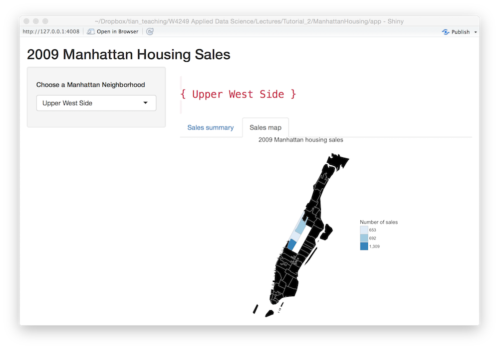

# Project 2: Open Data App - an RShiny app development project



## Project Title: Alternative Fuels in US
Term: Spring 2017

+ Team 7
+ **Alternative Fuels in US**: 
	+ Yaqin Li
	+ Kai Chen
	+ Yue Gao
	+ Yi Xiang
	+ Yuxi Zhou


+ **Project summary**: This project produced a shiny app which contains two parts: part1 - alternative fueling station locator and route planner, part2 - trend analysis of US alternative fuels stations and resources. In the first part, user can find nearby fueling stations or plan a route which would pass at least one fueling station. In the second part, we conducted statistical analysis towards the trend of US alternative fuels and fueling stations in the past 47 years. Research includes the environmental benefits of alternative fuels, the development trend of fueling stations and vehicles using such fuels.

+ **Contribution statement**: 
	+ Yaqin Li: 
	Team Leads;
	Presenter;
	NewYork Alternative Fueling Stations Find Route Algorithm;
	Data Cleaning;
	ShinyApp Design and Debug.
		
	+ Kai Chen
    + Yue Gao:
    Vehicle data analysis (fuel type analysis, alternative fuel vehicle comparison);
    Appendix structuring.

	+ Yi Xiang:
	States Route Code Design;
	ShinyApp Initialization, Find-Route Structuring;
	Repo Structuring.

	+ Yuxi Zhou

This folder is orgarnized as follows.

```
proj/
├── app/
├── lib/
├── data/
├── doc/
└── output/
```

Please see each subfolder for a README file.

